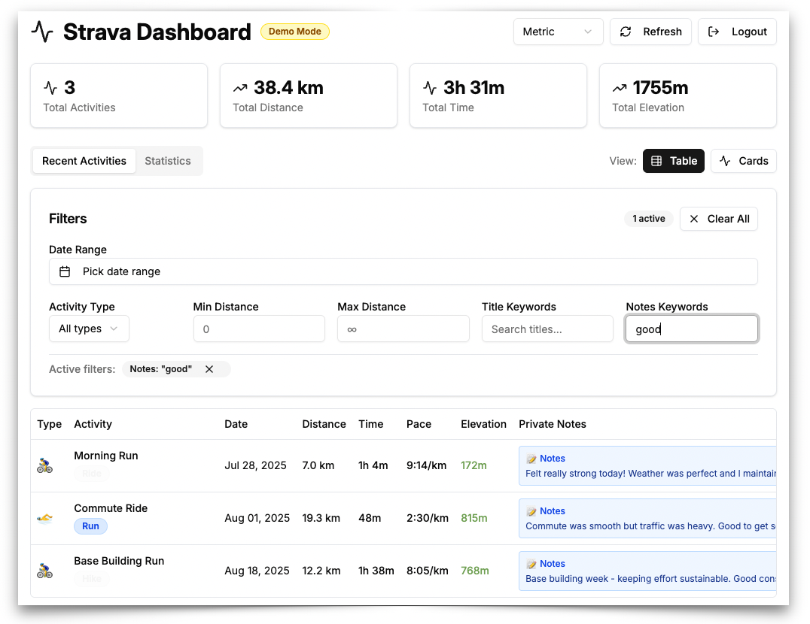

# Private Note Viewer for Strava

## The Problem

As an athlete, you probably track more than just your workouts in Strava. Maybe you've been diligent about logging injuries, pain levels, recovery notes, or training observations in your **Private Notes** – those personal notes that only you can see on each activity.

But here's the frustrating part: months later, when you're trying to understand how an injury developed or recall what worked during your last training cycle, those valuable notes are buried and nearly impossible to search through. Strava doesn't provide an easy way to view all your private notes in one place or search through them effectively.

## The Solution

I built this app to solve exactly that problem. **Private Note Viewer for Strava** gives you a searchable, organized view of all your private notes alongside your activity data. Now you can:

- **Search through all your private notes** to find patterns in injuries or training
- **Filter activities** by sport type, date range, or keywords in your notes  
- **Review your injury history** to understand what led to problems and what helped recovery
- **Track your training thoughts** over time to see what strategies worked best
- **Export your data** to keep your own backup of these important insights

This isn't just another activity dashboard – it's specifically designed to make your private notes useful and accessible.

## Who This Is For

- **Athletes who use Strava's Private Notes** to track injuries, pain, recovery, or training insights
- **Anyone frustrated** by Strava's lack of searchable private note history
- **Runners, cyclists, and other endurance athletes** who want to understand injury patterns
- **People who want to own their data** and have better access to their training notes



## Quick Start (Non-Technical Users)

Don't worry – you don't need to be a programmer to use this! Here's how to get started:

### Option 1: Try the Demo First
1. Visit the app (instructions below for setup)
2. Click **"Try Demo Mode"** to see how it works with sample data
3. No Strava connection required – just explore the features

### Option 2: Connect Your Real Strava Data
1. Follow the setup instructions below (they're simpler than they look!)
2. Click **"Connect with Strava"** 
3. Authorize the app to read your activities and private notes
4. Start searching and organizing your notes immediately

**Important**: This app only reads your data – it never modifies or deletes anything in your Strava account.

## Setup Instructions

### What You'll Need
- A computer (Windows, Mac, or Linux)
- About 15 minutes for setup
- Your Strava account login

### Step-by-Step Setup

**Don't panic if these steps look technical – just follow them one by one:**

1. **Install Node.js** (this is the engine that runs the app):
   - Go to https://nodejs.org
   - Download the "LTS" version (the green button)
   - Run the installer with default settings

2. **Download this app**:
   ```bash
   # Open Terminal (Mac) or Command Prompt (Windows)
   # Copy and paste this command:
   git clone https://github.com/jessephus/private-note-viewer-for-strava.git
   cd private-note-viewer-for-strava
   ```

3. **Install the app**:
   ```bash
   # Copy and paste this command:
   npm install
   ```

4. **Set up Strava connection** (optional - skip if you just want to try demo mode):
   - Visit https://www.strava.com/settings/api
   - Create a new app (use any name, website, and description you want)
   - Copy your Client ID and Client Secret
   - Create a file called `.env` in the app folder with:
     ```
     STRAVA_CLIENT_ID=your_client_id_here
     STRAVA_CLIENT_SECRET=your_client_secret_here
     ```

5. **Start the app**:
   ```bash
   # First, start the background server:
   npm run server
   
   # Then in a new Terminal/Command Prompt window:
   npm run dev
   ```

6. **Open your browser** and go to: http://localhost:5173

That's it! You now have your own private note viewer running.

## Features

- 🔍 **Search Your Notes**: Find activities by keywords in your private notes
- 📅 **Filter by Date**: Look at specific time periods to track injury progression
- 🏃‍♂️ **Filter by Sport**: Focus on running injuries vs cycling issues, etc.
- 📊 **Visual Timeline**: See your activities and notes in chronological order
- 🔒 **Private & Secure**: Your data stays on your computer – nothing is stored elsewhere
- 💾 **Export Options**: Save your data as files for backup or further analysis
- 📱 **Works on Mobile**: Use on your phone or tablet too

## Common Questions

**Q: Is this safe? Will it change my Strava data?**
A: Completely safe! This app only *reads* your data. It cannot modify, delete, or post anything to your Strava account.

**Q: Can other people see my private notes?**
A: No! Your notes stay private. This app runs entirely on your own computer.

**Q: What if I'm not technical?**
A: The setup instructions are designed for beginners. If you get stuck, the error messages usually tell you exactly what to do.

**Q: Do I need to keep my computer running?**
A: Only when you want to use the app. You can close it anytime and restart it later.

## Troubleshooting

### "Command not found" errors
- Make sure you installed Node.js from the official website
- Restart your Terminal/Command Prompt after installing Node.js

### "Cannot connect to Strava" errors
- Check that you copied your Client ID and Client Secret correctly
- Make sure both the server (`npm run server`) and app (`npm run dev`) are running

### Other issues
- Try the Demo Mode first to make sure the app works
- Check the Terminal/Command Prompt for error messages – they usually explain the problem
- Make sure no other apps are using ports 3001 or 5173

## Technical Details (For Developers)

Built with modern web technologies:
- **React 19** with hooks
- **Vite** for fast development
- **Tailwind CSS** for styling
- **Node.js** backend for secure OAuth
- **JavaScript** (no TypeScript complexity)

## Project Structure

```
src/
├── components/          # React components
│   ├── ui/             # Reusable UI components
│   ├── AuthLanding.jsx # Authentication landing page
│   ├── Dashboard.jsx   # Main dashboard component
│   └── ActivityCard.jsx # Individual activity display
├── hooks/              # Custom React hooks
│   ├── use-local-storage.js # localStorage hook
│   └── use-mobile.js   # Mobile detection hook
├── lib/                # Utility libraries
│   ├── utils.js        # General utilities
│   └── strava-api.js   # Strava API integration
└── styles/             # CSS and styling
```

## License

MIT License - see LICENSE file for details

## Contributing

1. Fork the repository
2. Create a feature branch: `git checkout -b feature-name`
3. Commit your changes: `git commit -am 'Add some feature'`
4. Push to the branch: `git push origin feature-name`
5. Submit a pull request